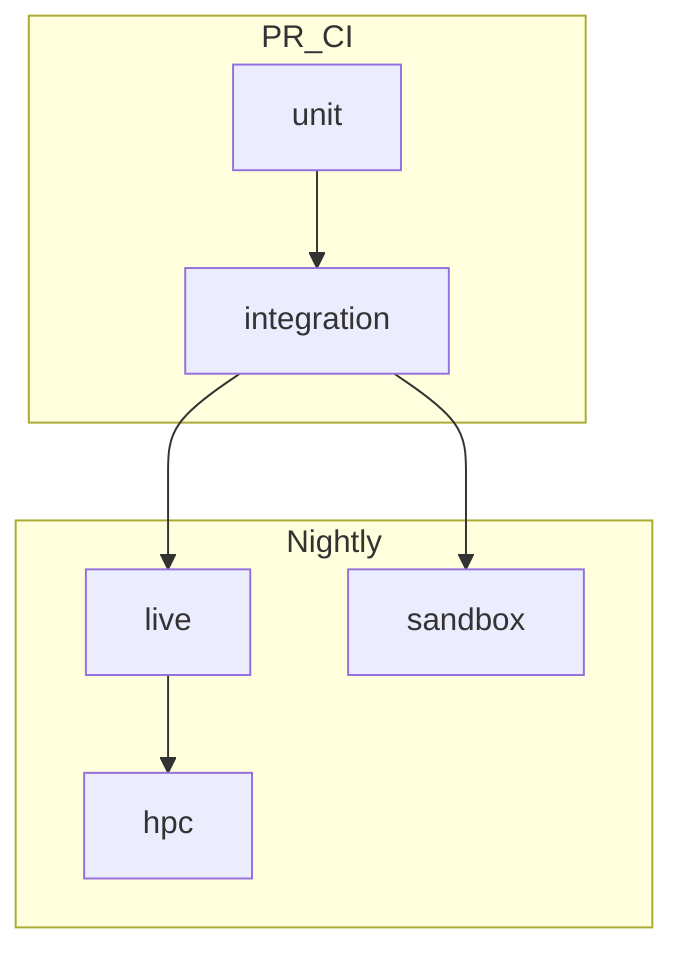

# VISTA Testing Roadmap

Shareable source of truth for making VISTA’s major components testable and
validatable. Implement **one milestone at a time** as a focused MR; each
milestone doc has checklists, file targets, and acceptance criteria.

| Milestone | Doc | Status |
|-----------|-----|--------|
| A — CI truth + HPC contracts | [milestone-a-ci-and-hpc.md](./milestone-a-ci-and-hpc.md) | Merged (`5787935`) |
| B — ProjectAgent loop + API | [milestone-b-agent-loop.md](./milestone-b-agent-loop.md) | In review ([!102](https://gitlab.com/amsc2/genesis/vista/-/merge_requests/102)) |
| C — Scientific tools | [milestone-c-scientific-tools.md](./milestone-c-scientific-tools.md) | Next |
| D — Validation lane (nightly / live) | [milestone-d-validation-lane.md](./milestone-d-validation-lane.md) | Planned |

Status vocabulary: **Merged** — on `main`; **In review** — MR open, not yet on
`main`; **Next** — the milestone to pick up; **Planned** — scoped but not
started. Update this table and the milestone doc's own `Status:` line in the
same MR that changes a milestone's state.

Operational metrics / load generation (not a substitute for unit tests):
[evaluation-runbook.md](../evaluation-runbook.md).

## Out of scope

**VISTAGuard** (gates G1–G7, Q-LLM, approval-capability security tests, and
red-team harnesses) is **out of scope for this entire roadmap**. Do not add
guard deliverables to these milestones. Tenant / volume isolation that already
exists (e.g. `backend/tests/security/test_tenant_isolation.py`) remains in
scope as multi-tenancy coverage, not as VISTAGuard work.

## Principles



- **Hermetic PR CI** — no AmSC API keys, Globus, or real Slurm required to merge.
- **Fake at boundaries** — mock IRI / Globus / LLM; keep catalog parsing,
  metadata injection, and HPC dry-run real.
- **Reuse existing patterns**
  - Agent harness (scripted LLM + fake MCP toolset + HTTP client) —
    [`backend/tests/harness/`](../../backend/tests/harness/)
  - `FunctionModel` — [`backend/tests/test_campaign_driver.py`](../../backend/tests/test_campaign_driver.py)
  - Dry-run HPC — [`mcp_servers/vista_mcp_server/tests/test_dry_run.py`](../../mcp_servers/vista_mcp_server/tests/test_dry_run.py)
  - In-memory DB — [`backend/tests/conftest.py`](../../backend/tests/conftest.py)
  - Live eval ops — [`docs/evaluation-runbook.md`](../evaluation-runbook.md)
- **Pytest markers** (introduced in Milestone A): `unit`, `integration`,
  `live`, `sandbox`, `hpc`. Default PR CI expression:
  `not live and not hpc and not sandbox` (sandbox stays `allow_failure` until
  Milestone C stabilizes it).

## Current coverage snapshot

Rows tagged *(Milestone B)* land with
[!102](https://gitlab.com/amsc2/genesis/vista/-/merge_requests/102) and are not
on `main` yet; everything else is merged.

| Area | Coverage today | In PR CI? |
|------|----------------|-----------|
| Campaign framework (planner / subagent / monitor / DB / API) | Strong | Yes (`backend`) |
| Access control / membership / auth identity | Strong | Yes |
| Chat sessions | Strong | Yes |
| Metrics / eval plumbing | Strong | Yes |
| TTL pool, StreamMerger | Strong | Yes |
| HPC dry-run + fault injection + job registry | Decent | Yes (`vista-mcp:test`) |
| Job catalog + JobSpec fakes (Milestone A) | Strong | Yes |
| `dev_mcp` `view` path | Decent | Yes (`allow_failure`) |
| Tenant isolation / canary | Exists | Yes |
| ProjectAgent main chat path (Milestone B) | Strong | Yes |
| Agent HTTP/SSE contract + authz (Milestone B) | Strong | Yes |
| MCP elicitation / tool-approval plumbing (Milestone B) | Decent | Yes |
| IRI / Globus submit path (beyond dry-run) | JobSpec fakes (Odo/PM/Frontier) | Yes |
| RAG | Thin | No |
| Skills / project prompt assembly | Prompt assembly covered; loading thin | Partial |
| UI runtime | Lint + typecheck only | No |

## Local commands

```bash
./scripts/ci-local.sh                  # all lint + test (mirrors GitLab CI)
./scripts/ci-local.sh backend test     # backend pytest
./scripts/ci-local.sh mcp test         # MCP servers (see Milestone A for vista_mcp)

cd backend && uv run --extra dev pytest -vv
cd mcp_servers/dev_mcp_server && uv run pytest
cd mcp_servers/vista_mcp_server && uv run --extra dev pytest
```

## MR conventions

- One milestone per MR when possible.
- Link the milestone doc in the MR description and check off its acceptance criteria.
- Conventional commits (`test:`, `ci:`, `docs:`).
- Do not require live LLM or HPC secrets for PR pipelines.
