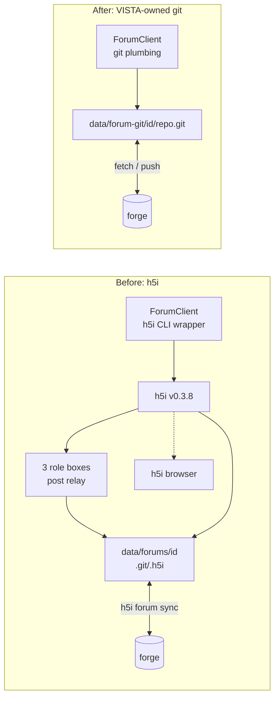

## Context

See proposal.md for why. This change sits on the `agent-forum` branch and
replaces only the layer that talks to h5i. Everything above `ForumClient`
(`DebateOrchestrator`, the role agents, `services/debate.py`'s DB projection,
`api/debate.py`, the Hypothesis Lab UI) keeps its shape.

Decisions below were settled in a grilling session with Sam Baumann on
2026-09-23 and are numbered Q1–Q14 to match the review doc "Forum Git Backend —
Design Summary" (a Claude Docs page Sam owns). This file is self-contained;
the doc is not needed to implement. Junqi's MR reply (2026-09-24) settled the
remaining questions: system git is required, signing is out of this change
(D8), and no threads are migrated.



Current-state facts the design relies on (verified in the code on 2026-09-23):

- `services/h5i_forum.py` (963 lines) defines `PostKind`, `POSTABLE_KINDS`,
  `VouchLane`, `Post`, `Thread`, `ThreadSummary`, `Participant`, `SyncResult`,
  the error types (`ForumError`, `ForumDisabled`, `ForumCommandError`,
  `ThreadClosed`, `PostNotConfirmed`, `InvalidKind`) and `ForumClient`.
  Importers: `agents/forum/{project_forum,debate,grounding,roles,simulation,
  wiring}.py`, `agents/campaign/wiring.py`, `services/debate.py`,
  `api/{debate,projects,api}.py`, `config.py`, and eight test modules.
- `ForumClient` methods with callers: `create_thread`, `list_threads`,
  `read_thread`, `post_as`, `post_as_human`, `close_thread`, `vote`, `sync`,
  `set_remote`, `remote`, `stage_attachment`, `create_participant`,
  `remove_participant`, `vote_policy`, `set_vote_policy`, `enrollments`.
  `fetch_attachment` has no callers.
- Attachments are written in two places: `DebateOrchestrator._stage_receipts`
  (`agents/forum/debate.py:499`, one `citations.json` per post, the full tool
  receipts) and `simulation.post_result` (`agents/forum/simulation.py:610`,
  `simulation-<job>.json`, a small JSON report with state and output paths).
  The `read_attached_paper` receipt contains the paper's full extracted text
  (up to 60k characters), so `citations.json` can reach hundreds of KB.
- A late HPC result posts back under the commissioning role's identity, which
  is saved in the campaign step's `spec` (`commissioned_by`, `box_slug`,
  `box_id`, `thread_id`, `reply_to`; `simulation.py:289`, `:597`, `:665`).
- `DebateParticipantBase` has `identity`, `debate_role`, `forum_role`,
  `box_slug` (NOT NULL), `box_id` (NOT NULL), `policy_digest`, `active`,
  `granted_tools`. `DebatePostBase` has `post_id`, `kind`, `body`, `sender`,
  `forum_role`, `box_id`, `policy_digest`, `origin`, `reply_to`, `ts`,
  `vouch_lane`, `denied`, `authored_by`, `votes`, `peer_votes`, `round_index`,
  `tools_used`. `DebateStatePublic` carries `enrolled_origins`.
- `db/db.py::_add_missing_columns` only ever ADDs nullable columns at startup;
  it never drops. `backend/scripts/migrate_columns.py` is the branch's manual
  migration script (`--dry-run` supported).
- `GET /projects/{name}/forum/status` returns `ForumStatus{enabled, shared,
  remote, vote_policy, enrolled, votes_counting}`; the UI proxies it at
  `ui/app/api/forum/status/route.ts` and shows a "votes are being discarded"
  banner from `votes_counting`.
- `ForumSettings` fields: `enabled`, `binary`, `repo_root`, `box_profile`,
  `box_isolation`, `egress`, `timeout`, `max_job_wait_seconds`,
  `job_poll_seconds`, `default_rounds`, `remote_url`, `vote_policy`.
  `repo_root` / `remote_url` are filled per project by
  `project_forum.forum_config_for`; `check_legacy_forum_env` clears env values.
- `settings.forums_dir` is `data/forums/`; each project's h5i working repo is
  `data/forums/<project-id>/`.
- The backend requires Python ~=3.14.3, so `uuid.uuid7()` is in the stdlib.
- GitLab `backend:test` installs `git` in its image (`.gitlab-ci.yml`, for the
  PALISADE git dependency), so real-git tests run in PR CI.

## Goals / Non-Goals

**Goals:**

- Same `ForumClient` surface for the orchestrator, API and simulation code, so
  the change is concentrated in one module plus deletions.
- Every behaviour in specs/agent-forum/spec.md testable against real git with
  no network.
- No legacy h5i code path anywhere after the change (Q13).

**Non-Goals:**

- Commit signing and verified attribution (D8). Deferred to a later change.
- Windows. It lands as its own MR; anything Windows-specific is resolved there.
- Whether a GUI-launched desktop app inherits `SSH_AUTH_SOCK`. Out of scope;
  v1 relies on whatever environment the backend process has.
- Bundling git (future option), a VISTA-managed forge token (future option,
  Q12b), a standalone posting CLI (future option, Q4c), content-addressed
  attachment dedupe (future option, Q3c), web grounding (`web_fetch_tool`,
  future option).
- Letting people or agents outside VISTA post (Q4a). They can read threads on
  the forge's web UI. The format stays plain and versioned so this can change.
- Migrating h5i threads (Q13).

## Decisions

### D1. Git plumbing on a bare working repo, not checkouts

Each project gets `data/forum-git/<project-id>/repo.git`, a **bare** repository.
Posts are written with plumbing: `git hash-object -w --stdin` for each file,
`git mktree` for the new tree (parent tree plus the added entries),
`git commit-tree -p <parent>`, then `git update-ref <ref> <new> <old>` as a
compare-and-swap. No worktree, no index, no checkout.

Why: several debates and roles post concurrently from one process. A checkout
has one index and one HEAD; plumbing on refs is safe per thread with a CAS and
an `asyncio.Lock` per (project, thread). Alternatives: a non-bare clone with
`git add/commit` (index contention, needs serialising the whole repo);
dulwich (pure Python, but push auth support unverified, and real git
behaviour is what the tests should pin).

Layout under `data/forum-git/`:

```
data/forum-git/
  host_id                       # Q2: random id, created once per install
  <project-id>/
    repo.git/                   # bare working repo
    attachments/<post-id>/<name>  # full copies of truncated attachments (Q3b)
```

`settings.forum_git_dir` (`data/forum-git/`) replaces `settings.forums_dir`. Old `data/forums/` h5i
directories are left untouched (Q13); nothing reads them.

### D2. Thread and post format (v1)

Ref: `refs/heads/vista-forum/threads/<thread-id>`, `<thread-id>` a uuid7
string. It lives under `refs/heads/` because forge branch rules only reach that
namespace (same reason h5i used `--branch-refs`).

Root commit of a thread adds `thread.json` and the framing post:

```json
{"v": 1, "id": "<thread-id>", "title": "...", "created_at": "<RFC 3339>",
 "created_by": "<host-id>"}
```

Every later commit adds exactly one `posts/<post-id>.json` and optionally
`posts/<post-id>/<attachment-name>`:

```json
{
  "v": 1,
  "id": "<uuid7>",
  "thread": "<thread-id>",
  "kind": "PROPOSAL",
  "body": "...",
  "identity": "vista-proposer-1a2b3c4d",
  "role": "proposer",
  "origin": "<host-id>",
  "ts": "<RFC 3339, informational>",
  "reply_to": null,
  "attachments": [{"name": "citations.json", "kind": "text", "size": 1234,
                   "sha256": "...", "truncated": false}]
}
```

- `kind` keeps today's `PostKind` values. The framing post is `TASK`; closing
  writes `CLOSED`; votes are `UPVOTE`/`DOWNVOTE`. `REVIEW_REQUEST` and `CLAIM`
  (h5i verbs VISTA never wrote) are dropped from `PostKind`. `POSTABLE_KINDS`
  stays as the validation set for role posts.
- `identity` replaces h5i's `sender`; the operator is `human`. The API keeps
  exposing it as `sender` so the UI contract does not move.
- Readers ignore keys they do not know, so optional fields (for example a
  future `signer`, D8) can be added without bumping `v`. `v` changes only for
  an incompatible change.
- Order is `git rev-list --reverse --first-parent <ref>`: the order the remote
  accepted commits. A commit is mapped to the post file it adds; a peer commit
  adding several post files contributes them in path order; a commit adding
  none is ignored. `ts` is display-only.
- `role` is the display role shown beside the identity (proposer, reviewer,
  referee, human). Added during implementation: the prompts and the UI show it,
  and it is as much a claim as `identity`.
- Commit author/committer: `vista-forum <host-id@vista-forum.invalid>`, passed
  as `GIT_AUTHOR_*` / `GIT_COMMITTER_*` environment variables (which also
  override any the user has exported). Never the user's `git config`, which
  would publish their email (the concern that ruled out email-based host ids in
  Q2).
- Local plumbing runs with `GIT_CONFIG_GLOBAL=/dev/null` and
  `GIT_CONFIG_NOSYSTEM=1`, so user settings such as `commit.gpgSign`,
  `log.showSignature` or `core.hooksPath` cannot change what is written or how
  output parses. Only `fetch` and `push` read the user's config (credentials,
  `insteadOf`, SSH), and they run with `core.hooksPath` pointed at an empty
  path so the user's own pre-push hooks never run on a forum push.
- Readers skip and log any file under `posts/` that is not valid JSON, has an
  unknown `v`, an unknown `kind`, or a mismatched `id`/`thread`.

Alternatives: one `posts.jsonl` per thread (every concurrent post conflicts);
git notes (poorly supported by forges); a custom ref namespace outside
`refs/heads/` (unprotectable).

### D3. Local-first posting and sync (Q7)

- **Post:** under the thread lock, read the local ref tip, refuse with
  `ThreadClosed` if the tip's tree holds a `CLOSED` post, write the commit
  (D1), CAS the local ref, record the post in the outbox (D4), return the
  `Post`. The local commit is the confirmation; `PostNotConfirmed` and the
  re-read loop go away. `InvalidKind` is still raised before any write.
- **Publish** (`sync`, and best-effort after each post, never blocking the
  turn on failure): `git fetch <remote> +refs/heads/vista-forum/*:refs/remotes/forum/vista-forum/*`;
  for each thread, if the local ref is not a fast-forward of the remote ref,
  **replay**: rebuild this install's unpublished posts (from the outbox, in
  their original order) as new commits on top of the remote tip, reusing the
  same blobs, and move the local ref there. Post paths are unique, so replay
  never conflicts. Then `git push <remote> <local-ref>:<remote-ref>` (never
  `--force`). On a non-fast-forward rejection — or a ref-lock failure, which is
  how a forge reports two pushes arriving at the same instant — repeat
  fetch-replay-push up to `ForumSettings.push_retries` (default 5). Mark pushed
  posts published. A post attempts this straight after committing, but only if
  its pre-post fetch succeeded, so an offline turn never waits on the network
  twice.
- **Read:** `read_thread` fetches, merges as above without pushing, and reads
  the local ref. Callers already throttle it: `api/debate.py`
  (`FORUM_REFRESH_SECONDS = 10.0`, per-run locks, shared with the event stream)
  wraps `services/debate.refresh_from_forum`; a fetch costs ~1.5 s against
  GitHub (agent-forum §12.16). A failed fetch reads local state and reports it as possibly stale.
- **History rewritten on the remote:** when the remote tip does not contain a
  post this install already published, that post is simply unpublished again
  and replayed on the next publish. A peer post the remote dropped is left out
  of the rebuilt local ref, even when the remote was merely reset to an
  ancestor, so VISTA never re-publishes a peer's post someone removed.
- **Missing vs. not yet published:** after a *successful* fetch, a thread the
  remote lacks is missing if the local copy holds any peer post or any of our
  posts marked published; a thread holding only our unpublished posts is simply
  not published yet and is pushed. A failed fetch never decides either way. A
  missing thread is never pushed back (no resurrection). Peer posts that vanished from the remote
  stay in the DB projection, marked `on_remote = false` (D5).
- **Remote URL:** stored in the bare repo as remote `forum`
  (`git remote add/set-url forum <url>`). `remote()` returns it;
  `set_remote()` sets it.

### D4. Provenance lanes from an outbox table (Q1, Q2)

New table `forum_outbox`: `post_id` (PK), `project_id`, `thread_id`,
`created_at`, `published_at` (nullable). The row is written just before the
local ref moves (and removed if the compare-and-swap fails), so a crash leaves
at worst a row naming no post, never an unrecorded post of ours. The client
reaches it through an `Outbox` protocol: `DbOutbox` in the app, one SQLite file
per host in the real-git tests, `MemoryOutbox` for the fake client.

- `host-observed` ⇔ `post_id` is in `forum_outbox`. Never decided from
  `origin`, which a peer can copy.
- `unattributed` ⇔ not in the outbox and `origin` is missing or not a
  well-formed host id.
- otherwise `peer-claimed`.
- "Not yet published" ⇔ outbox row with `published_at IS NULL`.

`Thread.vouch` keeps its `post_id → lane` shape, so `Thread.is_observed`,
`is_operator`, `is_peer`, `tally_split` and the UI's `closedBy` keep working.
If the local DB is lost, this install's old posts read as `peer-claimed`;
accepted and documented.

Host id (Q2): `data/forum-git/host_id`, a uuid4 hex written once with mode
0600, read at startup. Alternatives rejected: `git config user.email` (leaks,
collides across two installs); the VISTA account (not per-install).

### D5. Votes, close, missing threads, DB columns

- **Votes (Q8):** `Thread.tally_split` counts one vote per
  (`origin`, `identity`, target), the latest by commit order, split into
  observed/peer by lane. `Thread.tally` becomes their sum. No vote policy.
- **Close (Q6):** readers truncate a thread's post list after the first
  `CLOSED` post; posting to a thread whose tip holds one raises `ThreadClosed`
  (checked after the best-effort fetch, so a peer's close is honoured). If our
  post lands after a peer's concurrent close, readers drop it; the orchestrator
  sees `ThreadClosed` on its next post. `Thread.status` is `closed` when a
  `CLOSED` post exists.
- **Missing thread (Q13):** a new `ThreadMissing(ForumError)` is raised by
  `read_thread`/`post_as` when neither the local nor the fetched remote ref
  exists. `services/debate.refresh_from_forum` and `api/debate.py`'s detail
  endpoint and event stream catch it: return the stored posts with `thread_missing: true` on the
  run's public state, stop polling, and refuse post/continue with 409. The UI
  shows "This thread is no longer on the forum." h5i-era runs take this path.
- **DB columns:** remove `box_slug`, `box_id`, `policy_digest` from
  `DebateParticipantBase` and `box_id`, `policy_digest` from `DebatePostBase`;
  add `DebatePostBase.published: bool | None` (from the outbox, for the UI) and
  `DebatePostBase.on_remote: bool | None`. `forum_role` stays (it is the
  display role). Existing branch-tester databases have `box_slug`/`box_id` as
  NOT NULL, which would break inserts: `scripts/migrate_columns.py` gains a
  step that drops those columns (`ALTER TABLE … DROP COLUMN`, SQLite ≥ 3.35),
  idempotent and `--dry-run`-able. No startup code, since these tables never
  shipped on `main`.

### D6. Roster without boxes or stints (Q5)

`Participant` shrinks to `identity`, `role` (proposer/reviewer/referee/human).
`create_participant` / `remove_participant` go away; `DebateOrchestrator.start`
writes three `debate_participant` rows with identities
`vista-<role>-<run-id[:8]>`. `resume`/continue reuse the active rows; the
stint suffix logic (`debate.py:236–243`), `_retire`'s forum revoke, and
§13.4/13.6/13.7's multi-stint bookkeeping are deleted. The campaign step spec
keeps `commissioned_by` (the identity) and `thread_id`/`reply_to`, and drops
`box_slug`/`box_id`; `simulation.post_result` builds its `Participant` from
`commissioned_by` alone.

`work_dir` goes away. `stage_attachment(participant, name, content)` keeps its
signature but now returns a handle the next `post_as` call commits beside the
post (D7).

### D7. Attachments (Q3, Q3b, Q10)

`post_as(…, attachment=, attachment_kind=)` commits the attachment at
`posts/<post-id>/<name>` in the same commit. Receipts stay unredacted (Q10).
If the UTF-8 content exceeds `ForumSettings.attachment_cap_bytes`
(1_048_576): keep the first ~1 MB, append
`\n[truncated by VISTA: <full-size> bytes, sha256 <hex>; full copy on the
posting host]`, record `size`/`sha256` of the full content and
`truncated: true`, and write the full content to
`data/forum-git/<project-id>/attachments/<post-id>/<name>`. `name` is
reduced to a basename and must not start with `.` (as today).

Alternatives: no cap (repos grow without bound, every peer downloads it all);
content-addressed `blobs/<sha256>` dedupe (deferred, Q3c).

### D8. Signing — out of scope

Signed post commits (SSH signing verified against keys the forge publishes for
an account, and a per-signer vote count) were planned as a final phase and are
now out of this change (Junqi, 2026-09-24). v1 attribution is the `identity`
and `origin` in each post, shown as the poster's claim, plus this install's
own lanes (D4). Notes from the grilling session, for whoever picks it up:
sign with `git commit-tree -S` under `gpg.format=ssh`; key from `ssh-agent` or
a VISTA-generated key the user registers; add an optional `signer` field
(`"<forge-host>/<login>"`); verify with `git verify-commit` and an
allowed-signers file built from the forge's keys (GitHub's `/<login>.keys`
lists authentication keys only; signing keys need
`GET /users/<login>/ssh_signing_keys`).

### D9. Git prerequisite (proposal: system git)

`services/git_check.py` (or inside the client module) resolves `git` on `PATH`
once at startup, with a 5 s timeout:

1. On macOS, if it resolves to `/usr/bin/git`, run `xcode-select -p` first; a
   non-zero exit means the developer tools are missing, so report absent
   **without** running `/usr/bin/git` (running it pops the install dialog).
2. Run `git --version`, parse `major.minor`, require ≥ 2.34.

The result is a small value, `GitCheck{ok, path, version, reason}`, cached for
the process. `reason` is the user-facing text: `"Git is not installed."` when
no git is found (including the macOS shim case), `"Git <x.y> is too old; the
Hypothesis Lab needs 2.34 or later."`, or git's own error if `--version`
fails. The UI shows `reason` verbatim.

2.34 is not required by anything v1 does (plumbing, CAS `update-ref` and
refspec fetches are much older); it is kept so that adding SSH signing later
(D8) does not raise the requirement on users. Lowering it is a one-line
change if it excludes someone.

The result feeds `forum_config_for` (lab off when absent), `ForumStatus`
(`git_ok`, `git_reason`) and `_open_the_lab` (save fails with the reason).

Every git invocation: `asyncio.create_subprocess_exec` with an argument list,
`cwd` = the bare repo, environment adding `GIT_TERMINAL_PROMPT=0` (credential
helpers and ssh-agent still work, prompts never hang the backend),
`GIT_CONFIG_NOSYSTEM=1` is **not** set (user credential config must apply),
`LC_ALL=C` for parseable output, and `ForumSettings.timeout` per call.
`ForumCommandError` keeps its argv/stdout/stderr and `_collapse` message.

### D10. Configuration and API surface

- `ForumSettings`: remove `binary`, `box_profile`, `box_isolation`, `egress`,
  `vote_policy`; add `git_binary: str = "git"`, `push_retries: int = 5`,
  `attachment_cap_bytes: int = 1_048_576`. Keep `enabled`, `repo_root`,
  `remote_url` (per-project, filled by `forum_config_for`), `timeout`,
  `max_job_wait_seconds`, `job_poll_seconds`, `default_rounds`.
  `check_legacy_forum_env` stays.
- `ForumStatus` becomes `{enabled, shared, remote, git_ok, git_reason,
  unpublished}`; `vote_policy`, `enrolled`, `votes_counting` are removed, and
  with them the UI banner.
- `DebateStatePublic.enrolled_origins` and `_enrolled_origins` are removed.
- `WebReader`, `ENFORCING_TIERS` and the `read_web_page` tool are removed from
  `agents/forum/grounding.py`; `Grounding.browser` goes.

### D11. Testing (Q14)

- `backend/tests/test_forum_git.py` (replaces `test_h5i_forum.py` and
  `test_h5i_forum_live.py`): a pytest fixture makes a temporary bare "remote"
  and two client instances with separate `data/forum-git` roots and host ids
  ("host A", "host B"). Default PR markers (not `live`). Covers each scenario
  in specs/agent-forum/spec.md that belongs to the client.
- A `FakeForumClient` (in-memory, same interface) replaces the fake h5i shim
  for `test_debate_*.py`, `test_project_forum.py` and API tests.
- `test_git_check.py` for D9 with `PATH` manipulation and a stub
  `xcode-select`.

## Risks / Trade-offs

- [The user's git credentials are not visible to the backend process, e.g. no
  `SSH_AUTH_SOCK` when launched from a GUI] → project save fails with git's
  error, so it is discovered immediately; the VISTA-managed token (Q12b) is the
  documented fix if it proves common. Not investigated in this change.
- [Anyone with push access can post as anyone, close threads or delete refs;
  free private GitHub repos cannot protect refs (agent-forum §12.8c)] →
  unchanged from h5i. Lanes label rather than prevent; the missing-thread path
  and replay keep VISTA's own view intact. Signing (D8, deferred) would add
  verifiable attribution.
- [Local DB loss makes our own old posts read as `peer-claimed`] → accepted;
  documented in the format doc.
- [Repo growth from full receipts] → 1 MB cap per attachment; dedupe later.
- [A peer's close and our post race] → our post is committed after `CLOSED`
  and ignored by readers; the orchestrator stops on its next post.
- [Fetch latency on every read (~1.5 s)] → the existing 10 s refresh throttle
  in `api/debate.py` is kept; reads never block on a failed fetch.
- [git < 2.34 on some Linux distros] → lab off with a clear reason; the floor
  exists for future signing (D8) and can be lowered if it bites.

## Migration Plan

- No data migration (Q13). Existing h5i-era debates read as missing threads.
  Old `data/forums/` directories and `h5i-forum/**` refs on forges are left in
  place; the hosting doc says they can be deleted.
- Branch testers run `uv run python scripts/migrate_columns.py` once to drop
  the NOT NULL box columns (D5).
- Archive `agent-forum` and this change together at merge, `agent-forum`
  first, so this delta applies to the spec it creates.
- Rollback: revert the branch commits; nothing outside the branch depends on
  the forum.

## Open Questions

None.
